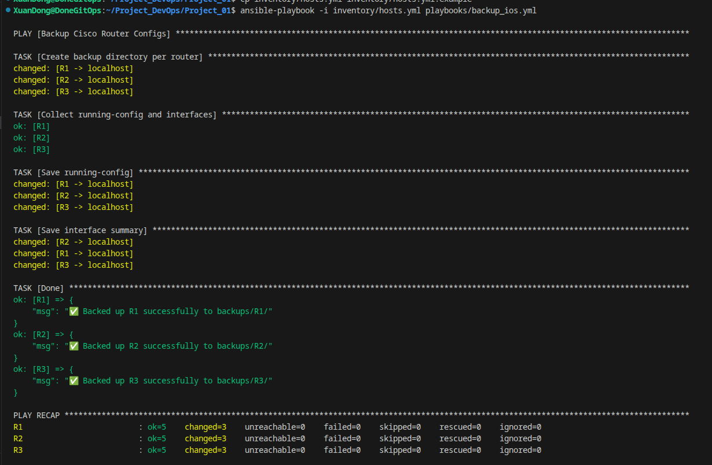

# Network Automation Lab: Ansible & GNS3

Dự án tự động hóa mạng thực tế, sử dụng **Ansible** để quản lý và sao lưu cấu hình (Backup Configuration) hàng loạt từ các thiết bị **Cisco IOS** chạy trên môi trường giả lập **GNS3**.

## 📐 Sơ đồ Lab (Topology)
Sơ đồ mạng định tuyến chuỗi gồm 3 Router Cisco c7200 kết nối với Control Node (Ubuntu 24.04).


## 🌟 Các tính năng nổi bật (v1.1 "Pro")
- **Quản lý đa thiết bị:** Hỗ trợ backup đồng thời R1, R2, R3 trong một sơ đồ mạng định tuyến nối tiếp (Routed Topology).
- **Tự động phân loại (Dynamic Directory):** Playbook tự động nhận diện thiết bị và tạo thư mục lưu trữ riêng biệt (`backups/R1/`, `backups/R2/`, ...).
- **Lưu trữ lịch sử (Timestamping):** Tự động gắn thẻ ngày giờ (`date +%Y%m%d_%H%M%S`) vào tên file backup, giúp theo dõi lịch sử cấu hình mà không bị ghi đè.
- **Bảo mật (Security Best Practices):**
    - Thông tin nhạy cảm (credentials) được tách biệt hoàn toàn khỏi mã nguồn thông qua cơ chế `.gitignore`.
    - Cung cấp file mẫu `inventory/hosts.yml.example` an toàn để public.
- **Tương thích SSH (Compatibility Fix):** Giải quyết triệt để vấn đề bất đồng bộ thuật toán mã hóa (Kex, Ciphers, MACs) giữa Ubuntu 24.04 đời mới và Cisco IOS đời cũ bằng cấu hình SSH nâng cao.

## ⚙️ Công nghệ sử dụng
- **Control Node:** Ubuntu 24.04 LTS
- **Network Emulator:** GNS3 (Cisco c7200 IOS)
- **Automation:** Ansible (với thư viện chính quy `ansible-pylibssh`)
- **Version Control:** Git & GitHub Actions (CI/CD)

## 🚀 Hướng dẫn sử dụng nhanh
1. Đảm bảo GNS3 Lab đã hoạt động và máy Ubuntu đã thông mạng tới các Router.
2. Thiết lập Inventory an toàn:
   ```bash
   cp inventory/hosts.yml.example inventory/hosts.yml
   # Mở file hosts.yml và thay "YOUR_PASSWORD_HERE" bằng mật khẩu thật.
   ```
3. Thực thi Playbook:
   ```bash
   ansible-playbook -i inventory/hosts.yml playbooks/backup_ios.yml
   ```

## 🎯 Bằng chứng thực thi (Proof of Work)
Kết quả chạy Ansible thành công, vượt qua toàn bộ rào cản mã hóa bảo mật và lấy cấu hình của 3 Router lưu về máy Local:

